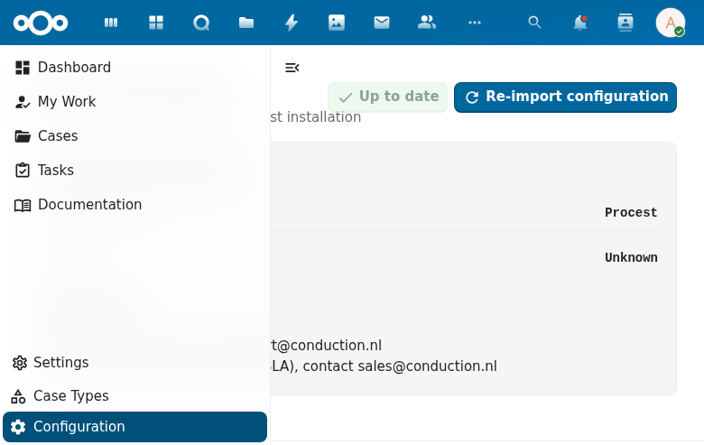

# Admin Settings (Configuration)

The Configuration page (under Settings) provides the central administration panel for Procest.

## Overview

The Configuration page displays:

### Version Information
- Application name and version
- Update status indicator
- Re-import configuration button for resetting to defaults

### Application Information
- **Application Name**: Procest
- **Version**: Displays the current installed version

### Support
- Support email: support@conduction.nl
- SLA inquiries: sales@conduction.nl

## Schema Configuration

The configuration section allows administrators to map Procest to OpenRegister schemas. See the [Case Types](case-types.md) documentation for the full list of configurable schema mappings.

## ZGW API Mapping

The settings page includes the ZGW (Zaakgericht Werken) API mapping configuration, which maps English-language OpenRegister property names to their Dutch ZGW API equivalents. This ensures compatibility with the Dutch government's ZGW standard for case management.

Each ZGW resource type (zaak, zaaktype, status, etc.) can be individually configured with custom field mappings.
