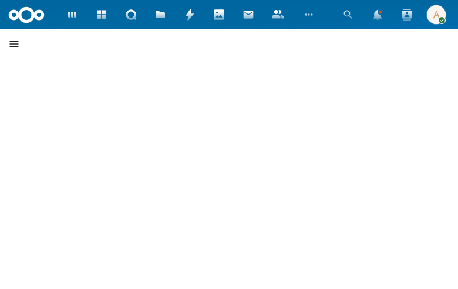

# Case Dashboard View

The case dashboard view shows the detail page for an individual case, accessible by clicking on a case from the My Work list or the Cases list.

## Overview

The case detail view is accessed via the URL pattern `/apps/procest/cases/{uuid}`. When navigating to a specific case (e.g., from the My Work list), the application loads the case detail page.

## Current State

The case detail view is under active development. The page loads at the correct route but the content area is currently blank, indicating that the case dashboard component is still being implemented.

## Planned Features

Based on the spec, the case dashboard view will include:

- **Case header** -- Title, identifier, status badge, and case type.
- **Status timeline** -- Visual representation of the case lifecycle stages.
- **Case details panel** -- Key properties such as dates, handler, initiator, and confidentiality level.
- **Tasks section** -- List of tasks associated with the case.
- **Documents section** -- Attached documents and correspondence.
- **Audit trail** -- History of status changes and actions taken on the case.
- **Actions** -- Buttons for common operations like changing status, adding tasks, or uploading documents.
