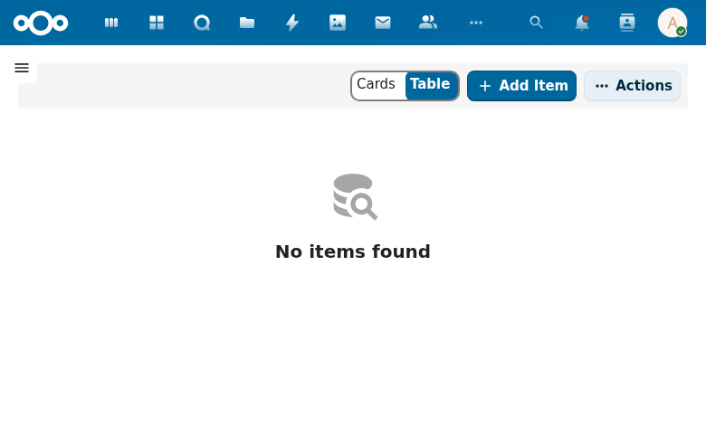

# Case Management

The Cases view provides a list of all cases in the system, with support for table and card display modes.

## Overview

The cases list supports two view modes, toggled via the Cards/Table radio buttons:

- **Table view** (default) -- Displays cases in a sortable, column-based table.
- **Cards view** -- Displays cases as individual cards for a more visual layout.

## Actions

- **Add Item** -- Creates a new case.
- **Actions** -- Bulk actions menu for selected cases.

## Current State

The case list view is functional but depends on the OpenRegister object type "case" being properly registered. If the object type is not configured, a "No items found" message is displayed.

## Data Model

Cases are stored as OpenRegister objects backed by a configurable schema. Each case typically contains:
- Case identifier (e.g., ZAAK-TEST-004)
- Title
- Status
- Assigned handler
- Start date and deadline
- Case type reference
- Related documents and tasks
