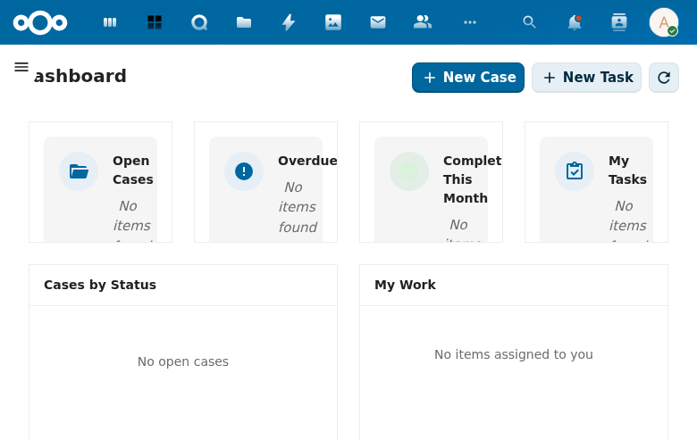

# Dashboard

The Procest dashboard is the landing page of the application, providing a high-level overview of the current user's case management workload.

## Overview

The dashboard displays four summary cards at the top:

- **Open Cases** -- Total number of active/open cases (e.g., 15).
- **Overdue** -- Cases that have exceeded their processing deadline.
- **Completed This Month** -- Cases resolved within the current calendar month.
- **My Tasks** -- Tasks assigned to the current user.

Below the summary cards, two panels provide quick access to key information:

### Cases by Status
A horizontal bar chart showing the distribution of cases across different statuses. This gives case workers an immediate sense of the pipeline.

### My Work
A list of cases assigned to the current user, showing:
- Case type badge (CASE)
- Case identifier (e.g., #ZAAK-TEST-006)
- Days remaining until the processing deadline

## Actions

Two primary action buttons are available at the top:
- **New Case** -- Opens the case creation form.
- **New Task** -- Opens the task creation form.
- **Refresh dashboard** -- Reloads dashboard data (disabled when already current).

## Navigation

The left sidebar provides navigation to all major sections:
- Dashboard (current)
- My Work
- Cases
- Tasks
- Documentation
- Settings (expandable, with Case Types and Configuration sub-pages)
