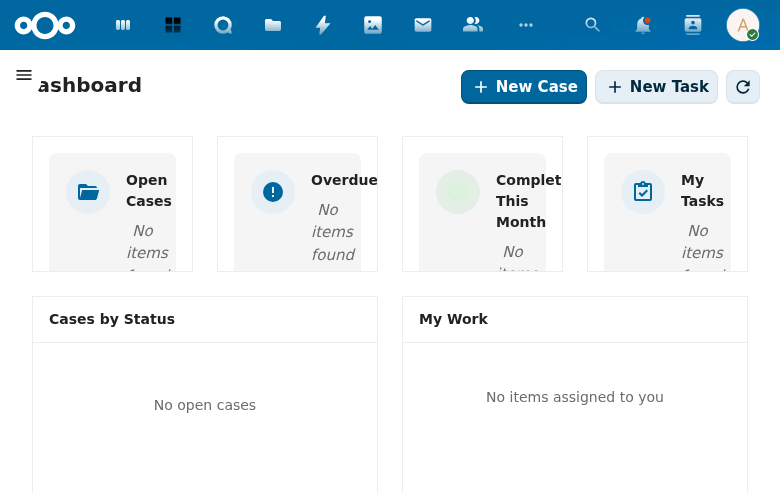

# My Work

The My Work view shows all cases and tasks assigned to the currently logged-in user, providing a personal work queue.

## Overview

The page displays a count of total items in the heading (e.g., "My Work (15)") and provides three filter tabs:

- **All (15)** -- Shows both cases and tasks combined.
- **Cases (15)** -- Filters to show only cases.
- **Tasks (0)** -- Filters to show only tasks.

A **Show completed** checkbox allows toggling visibility of finished items.

## Work Items

Each item in the list shows:
- **Type badge** -- "CASE" or "TASK" label.
- **Title** -- The case or task name (e.g., "Test Case 4").
- **Identifier** -- The case reference number (e.g., #ZAAK-TEST-004).
- **Days remaining** -- Time until the processing deadline, with warning indicators (exclamation mark) for items needing attention.

Items are grouped under an **UPCOMING** section header with a count.

## Interaction

Clicking on a case navigates to the case detail view at `/apps/procest/cases/{uuid}`. Clicking on a task would navigate to the task detail view.

## Data Source

My Work items are fetched based on the current user's assignments. The view queries OpenRegister for cases and tasks where the logged-in user is the assigned handler.
