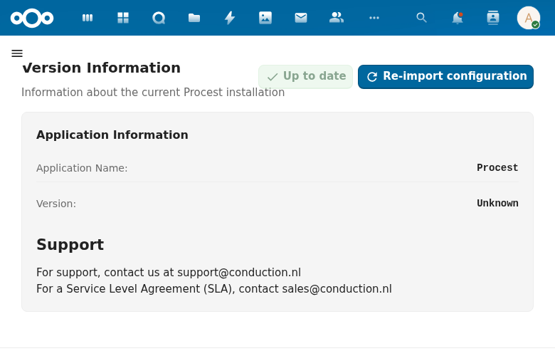

# Zaaktype Configuratie (Case Type Configuration)

The zaaktype configuration is part of the Settings area and provides ZGW-compliant case type management.

## Overview

This feature manages the mapping between Procest's internal case type definitions and the Dutch ZGW (Zaakgericht Werken) standard. It is accessible from the Case Types settings page.

## ZGW Resource Mapping

The configuration supports mapping for the following ZGW resource types:

| Resource | Description |
|----------|-------------|
| zaak | Case instance |
| zaaktype | Case type definition |
| status | Case status instance |
| statustype | Status type definition |
| resultaat | Case result instance |
| resultaattype | Result type definition |
| rol | Role assignment |
| roltype | Role type definition |
| eigenschap | Custom property |
| besluit | Decision instance |
| besluittype | Decision type definition |
| informatieobjecttype | Document type definition |

Each mapping includes:
- **Status** -- Enabled/Disabled indicator
- **Edit** -- Opens the field mapping editor
- **Reset** -- Restores the default mapping

## Purpose

The ZGW API mapping ensures that Procest can expose its data through ZGW-compatible API endpoints, enabling interoperability with other Dutch government systems that follow the ZGW standard (such as OpenZaak, Dimpact ZAC, and XXLLnc Zaken).
